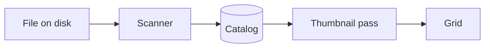

# First chapter

::: strip
Where: Anywhere in the app
For: Photographers
Answers: What does each block look like?
:::

A paragraph with **bold**, *italic*, `code` and a [link](https://example.com). Short sentences read well.

::: stats
12 | pages
3 | diagrams
97% | facts checked
:::

## A table with chips

| Format | Read | Write | Notes |
|:--|:--|:--|:----------|
| ARW | [ok] | [no] | Sony RAW, read through LibRaw |
| CR3 | [partial] | [no] | Thumbnails only; no EXIF reader yet |
| JPEG | [ok] | [ok] | Exports use the chosen profile |

| Finding | Severity | Status |
|:--|:--|:--|
| PIN field left empty removed the PIN | [medium] | [fixed] |
| Update checksum comes from the same place | [low] | [later] |

::: note Heads up
A note callout can hold **formatted** text and lists:

- first point
- second point
:::

::: warn
A warning callout, no title.
:::

::: tip Shortcut
Press `?` anywhere for the shortcut sheet.
:::

::: cards
#### Central
Sidecars live in the data folder. Photo folders stay untouched.

#### Beside
Next to each photo, where darktable looks.

#### Catalog only
No files written.
:::

## A diagram



## A chart

```chart Findings by area
{"type":"hbar","labels":["Security","Features","Ease of use"],"series":[{"name":"Findings","values":[14,6,9]}]}
```

## Steps and code

1. Open **Settings**.
2. Pick a tab.
   - nested bullet
3. Press **Save**.

```text Folder layout
Photos\
  2024\
    6-19-2024 Air Show\
```

> A quotation, as used for the licence text.
