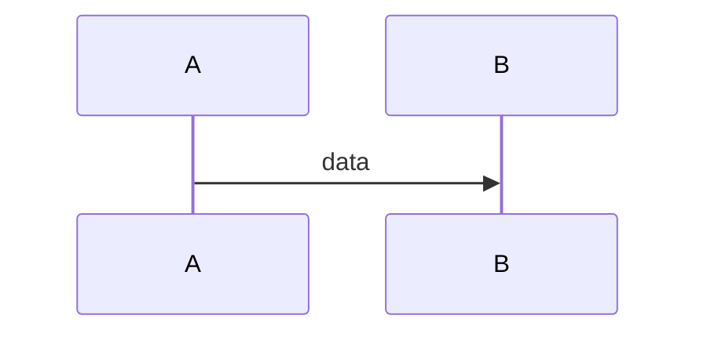

# The big picture
```mermaid System context: the program, its data folder and everything outside the PC.
flowchart LR
  user([User]) --> app[Application]
  app --> data[(Data folder)]
  app -. optional .-> net((Internet))
```

::: stats
<n> | places data is stored
<n> | network destinations
<n> | background workers
:::

# Trust boundaries
| Boundary | What crosses it | Direction | Guard |
|:--|:--|:--|:--|

# Flows
## <Flow name>


| Step | From | To | Data | Stored in |
|:--|:--|:--|:--|:--|

# Data inventory
| Data | Where it lives | Kept for | Leaves the PC? |
|:--|:--|:--|:--|

# Network use
| Destination | Why | When | What is sent | Default |
|:--|:--|:--|:--|:--|

# Failure paths
| What fails | What the program does | What the user sees |
|:--|:--|:--|

# To check
- <item>
