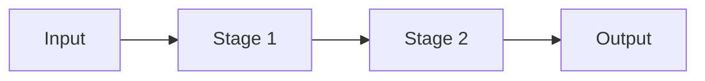

<!-- Every number (threshold, default, size) is read from the code and carries its file in the text or the table. -->

# The problem it solves
<Plain words. What goes wrong without it.>

::: stats
<n> | <what the first headline number is>
<n> | <second>
<n> | <third>
:::

# How it works

## Step by step
1. <Step, with the threshold>

## Decision points
| Question | Threshold | Where in the code |
|:--|:--|:--|

# Settings
| Setting | Default | Range | Effect |
|:--|:--|:--|:--|

# What it writes
| Where | What | When |
|:--|:--|:--|

# How it keeps your files safe
- <Guarantee, and the code that enforces it>

# A worked example
<A small, concrete walk through with made-up file names.>

# Known limits
- <Limit and its consequence>

# To check
- <item>
