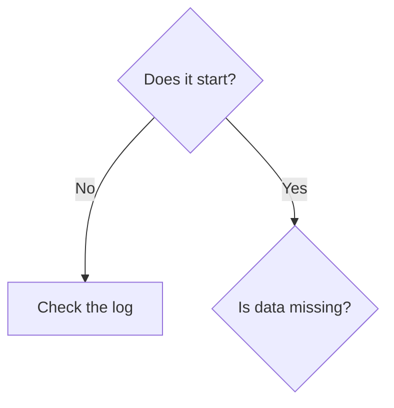

# Where things live
```text Data folder
<folder tree with one-line purposes>
```

# Install and update


# Back up and restore
## Back up
1. <Step>
## Restore
1. <Step>
::: warn
<What can go wrong, and how to avoid it.>
:::

# Recovery decision tree


# Health checks
| Check | How | Healthy looks like |
|:--|:--|:--|

# Logs and support
| File | What it holds | Where |
|:--|:--|:--|

# To check
- <item>
