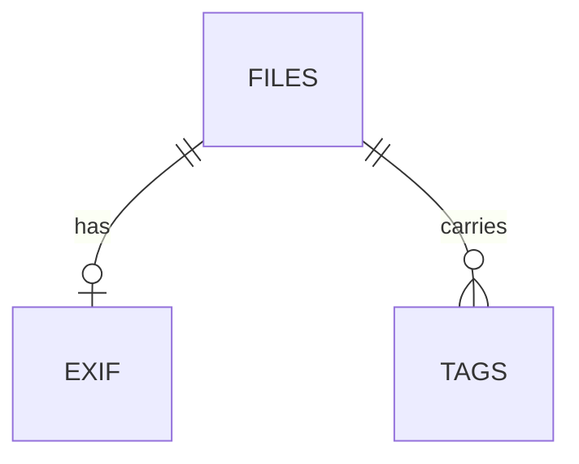

# Overview


::: stats
<n> | tables
<n> | migrations
<n> | version
:::

# Tables
## <Table>
| Column | Type | Meaning |
|:--|:--|:--|

# Migrations
| Version | What changed | Why |
|:--|:--|:--|

# Invariants
- <Rule that must always hold, and where it is enforced>

# Common queries
```sql <What it answers>
SELECT 1;
```

# To check
- <item>
