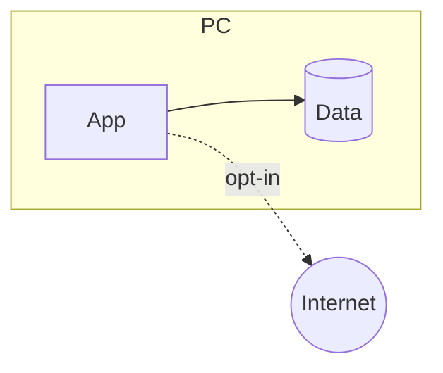

# Summary
::: stats
<n> | network destinations
<n> | open findings
<n> | controls in place
:::

# What is protected
| Asset | Why it matters | Where it lives |
|:--|:--|:--|

# Trust boundaries

# Controls
| Threat | Control | Where in the code | Status |
|:--|:--|:--|:--|

# Network use
| Destination | Purpose | What is sent | Opt-in? |
|:--|:--|:--|:--|

# Privacy inventory
| Data | Stored where | Leaves the PC? | How to remove |
|:--|:--|:--|:--|

# Findings
| ID | Finding | Severity | Status |
|:--|:--|:--|:--|

# Residual risk
<What is accepted, and why.>

# To check
- <item>
