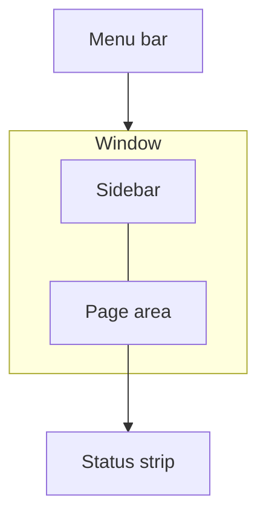

<!-- One chapter per page, in sidebar order. Quote labels exactly as the code spells them. -->

# The main window

## Menu bar
| Menu | Item | Keys | What it does |
|:--|:--|:--|:--|

# <Page name>

::: strip
Where: <sidebar group > page>
For: <purpose in a few words>
Answers: <the question this page answers>
:::

## Controls
| Control | What it does |
|:--|:--|

## Right-click menu
| Item | What it does |
|:--|:--|

## Keys on this page
| Keys | What it does |
|:--|:--|

# Reference
## All keyboard shortcuts
| Keys | Where | What it does |
|:--|:--|:--|

# To check
- <item>
